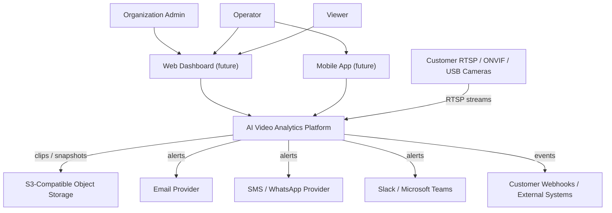
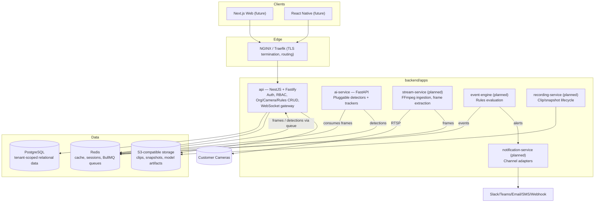
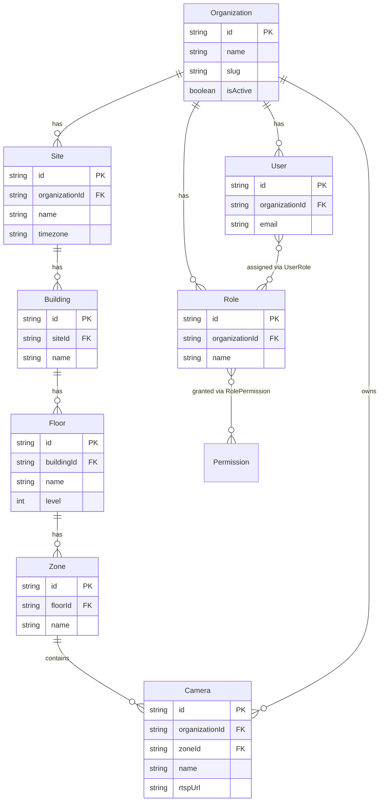
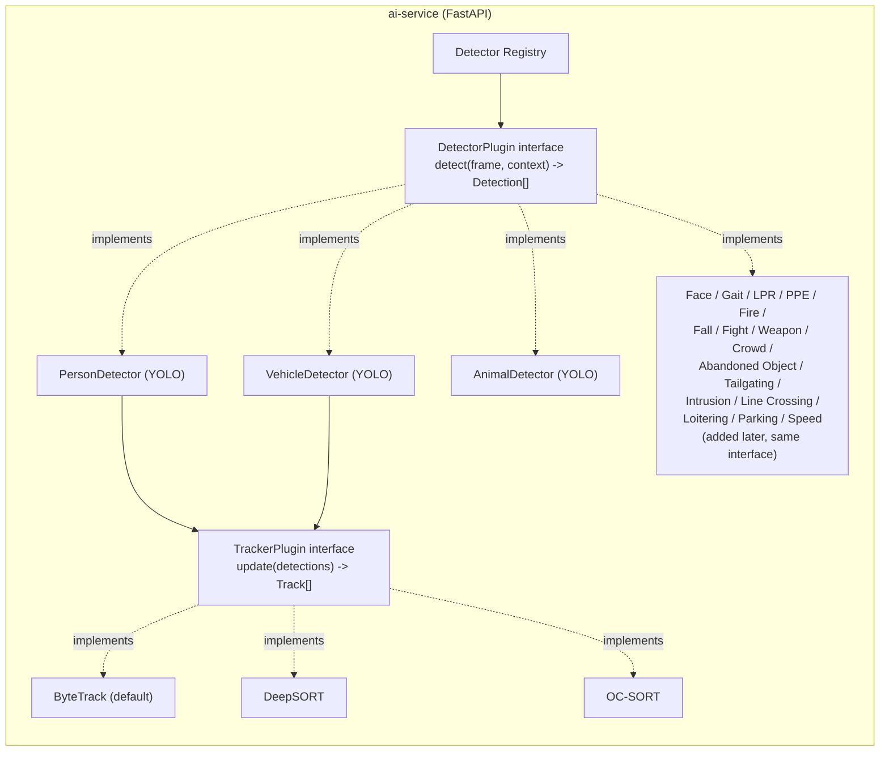
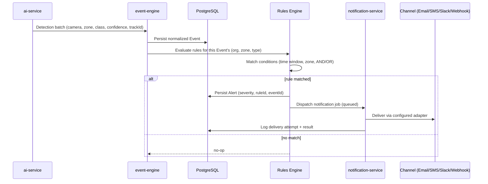

# High-Level Design (HLD)

**Product:** AI Video Analytics Platform
**Companion document:** `SRS.md` (requirements this design satisfies)
**Status:** Draft v1 — architecture for the full platform. LLDs are written per-module immediately before that module is built; see [§13 Roadmap](#13-roadmap--phasing).

---

## 1. Architecture Principles

1. **Clean/hexagonal boundaries.** Business logic (services) depends on interfaces (ports); infrastructure (Prisma, Redis, FFmpeg, notification providers) implements those interfaces (adapters). This is what makes AI models, trackers, and notification channels pluggable — the requirement, not a style preference.
2. **Modular monolith first, service-oriented where it earns its keep.** The NestJS `api` app stays a single deployable for request/response concerns (auth, CRUD, RBAC, rules CRUD) because splitting it now would add operational cost with no scaling benefit yet. Compute-heavy, independently-scalable concerns (AI inference, stream ingestion) are already separate services (`ai-service` today; `stream-service`, `event-engine`, `notification-service` follow in their phases) because *they* scale independently of the API.
3. **CQRS where it earns its keep, not everywhere.** Most modules stay simple service + repository (via Prisma). CQRS (separate read/write models) is reserved for the Reports/Dashboard/AI-Search read paths once they need denormalized, differently-shaped read models than the write-side schema — introduced in those phases, not retrofitted onto CRUD modules that don't need it.
4. **Tenant isolation is a data-layer guarantee, not just an API-layer check.** A missing `where: { organizationId }` in one query must not be catastrophic. See §4.
5. **Everything async and cross-service is queue-mediated.** Redis + BullMQ, not direct service-to-service HTTP calls, for anything that can be retried, backpressured, or fail independently (frame hand-off, notification delivery, report generation).
6. **No hardcoded AI/tracking/notification implementations in calling code.** Every one of those is a plugin behind a small, stable interface, selected by configuration, not by `if/else` on vendor name.

---

## 2. System Context

Actors: internal users (Admin/Operator/Viewer, tenant-scoped) via web/mobile clients (built after the backend); external systems are the cameras themselves (inbound RTSP) and outbound integrations (notification providers, customer webhooks, object storage).

---

## 3. Container / Service View

Today only `api` and `ai-service` exist; the queue-mediated boxes (`stream-service`, `event-engine`, `notification-service`, `recording-service`) are the target shape each future phase builds toward, so nothing built now has to be re-architected later — it slots into this diagram.

---

## 4. Multi-Tenancy Model

### 4.1 Isolation strategy decision

Three standard SaaS isolation strategies were weighed:

| Strategy | Isolation strength | Operational cost at 1000s of tenants | Chosen |
|---|---|---|---|
| Database-per-tenant | Strongest | High (migration fan-out, connection pool exhaustion) | No — reserved as a future "dedicated" tier for the largest enterprise customers if contractually required |
| Schema-per-tenant | Strong | Medium-high (still N schemas to migrate) | No |
| **Shared database, row-level `organizationId`** | Good, enforced in code + DB constraints | Low — one schema, one migration path, scales to thousands of tenants | **Yes** |

Shared-database row-level isolation is the standard, proven approach (Salesforce, most B2B SaaS) for this stage. It is revisited only if a specific enterprise contract requires physical data separation — the schema is designed so a tenant *can* be lifted into its own database later without an application rewrite, since every tenant-owned table already carries `organizationId` as its partition key.

### 4.2 Data model

Every tenant-owned table gets `organizationId` — including `Camera`, redundantly with its Zone→Floor→Building→Site chain, so a query can filter by tenant in one indexed column without a multi-join, and so a camera can exist unassigned to a Zone during setup without losing tenant scoping.

### 4.3 Enforcement layers (defense in depth)

1. **JWT claim.** Access tokens gain an `organizationId` claim alongside the existing `sub`/`permissions`. Every authenticated request carries its tenant identity without a DB lookup.
2. **Request-scoped tenant context.** A `TenantContextService` (Nest request-scoped provider, backed by `AsyncLocalStorage` so it's available even inside queue consumers processing a tenant-owned job) exposes `organizationId` to services without it being threaded through every method signature manually.
3. **Guard.** A `TenantScopeGuard`, global like today's `PermissionsGuard`, rejects any request whose route needs tenant context but has none (defense against a future public route accidentally exposing tenant data).
4. **Data-access layer.** A Prisma Client Extension intercepts every query against tenant-owned models and injects `where: { organizationId }` automatically, so a developer *cannot* forget the filter — this is the layer that satisfies FR-ORG-04 ("a bug in one endpoint cannot expose another tenant's rows"). Explicit cross-tenant access (Platform Owner support tooling, FR-ORG-05) uses a distinct, separately-audited code path that bypasses the extension deliberately, never silently.

### 4.4 Migration impact on existing Phase 2 work

`User` and `Role` gain `organizationId` (nullable during migration, backfilled to a default Organization created for existing data, then made required). `Permission` stays global (permissions are platform-defined capabilities, not tenant data — only *role→permission assignment* is tenant-scoped, since Roles belong to an Organization). This is a breaking schema migration, scheduled as the first LLD after this HLD is approved.

---

## 5. AI Engine Plugin Architecture

- `DetectorPlugin` and `TrackerPlugin` are the two stable contracts. A detector is enabled per-Organization/Zone via configuration in Postgres, read by `ai-service` at inference time — no code deploy needed to turn a detector on/off for a tenant.
- New detectors register their model artifact location (S3), input/output spec, and resource profile (CPU/GPU, expected latency) in the Model Registry table; the inference scheduler uses that profile for batching and GPU allocation.
- Execution backend (PyTorch native, ONNX Runtime, TensorRT) is an implementation detail of a given detector plugin, not something the platform core is aware of.
- Gait Recognition is sequence-based, not single-frame: it consumes a `Track`'s accumulated frame history from `TrackerPlugin` rather than one `frame` like Person/Vehicle/Face detectors. It still implements `DetectorPlugin`, but its `context` carries the track's buffered silhouette/pose sequence — the contract's `frame` argument is a single representative frame for logging/thumbnailing only. This is a plugin-level detail, not a platform-core change.
- A demo-scale instance of this `PersonDetector` → `TrackerPlugin` chain (real pretrained YOLOv8 + DeepSORT, via `deep-sort-realtime`) now exists standalone in `ai-service` (`app/detection/`), feeding both the Gait and suspicious-activity demos with real per-clip tracks instead of raw background subtraction. It's in-process only — no Postgres-backed per-Organization/Zone enable/disable, no Model Registry entry, no GPU batching scheduler — so it doesn't change FR-TRACK's `Planned` status below; same convention as the Gait demo itself against FR-AI-07.

---

## 6. Streaming Architecture (target shape, built in its phase)

RTSP → `stream-service` (FFmpeg) extracts frames at a configurable rate → frames are pushed onto a Redis/BullMQ queue keyed by camera → `ai-service` workers pull batches, run enabled detectors + tracker, emit normalized detections back onto a results queue → `event-engine` consumes results, normalizes into typed Events, persists, and evaluates Rules. GStreamer is a swappable ingestion backend behind the same `stream-service` port if FFmpeg proves insufficient for a given codec/transport. WebRTC is the low-latency preview path for the dashboard; HLS is the compatibility/scale fallback.

Failure isolation: one camera's FFmpeg process crashing restarts independently (supervised per-camera process/pod) and does not affect the queue or other cameras — this is what makes FR-STREAM-02 possible.

---

## 7. Event → Rules → Notification Pipeline (target shape)

Rules are evaluated per-Event as it arrives (not batch/cron), which is what keeps the critical-severity path under the 2-second target in the SRS.

---

## 8. Data Architecture

| Store | Purpose | Notes |
|---|---|---|
| PostgreSQL | System of record: Organizations, Users/Roles/Permissions, Cameras, Rules, Events, Alerts, Incidents, Audit Logs | Tenant-scoped via §4. Read replicas added at the "Large" scale tier for reporting queries. |
| Redis | Cache, session/refresh-token support data, BullMQ queues (frame hand-off, notification delivery, report jobs) | Single instance in dev; clustered/managed at scale. |
| S3-compatible object storage | Clips, snapshots, AI model artifacts | MinIO in dev, swappable for AWS S3 / Azure Blob / GCS via the same interface — no code depends on a specific provider. |

A time-series-optimized store (e.g. TimescaleDB extension on the existing Postgres, or ClickHouse) is a **scale-tier consideration**, not built now — flagged for the Enterprise (10,000-camera) tier if Postgres event-table write/query volume becomes the bottleneck. Not part of the current design; revisit with real numbers when Reports/AI-Search are built.

---

## 9. API Design Principles

- REST, OpenAPI/Swagger-documented (already the convention), URI versioning (`/v1/...`, already in place).
- Rate limiting (`@nestjs/throttler`) added during the foundation-hardening phase, applied per API key/user.
- WebSocket gateway (Nest's `@WebSocketGateway`, Fastify-compatible) for real-time alert/dashboard push, added when the Dashboard module is built.
- API keys for service accounts: a distinct auth strategy alongside JWT, scoped by the same permission system already in place — no parallel authorization model.

---

## 10. Security Architecture

Builds on what Phase 2 already established (JWT + rotating refresh tokens, permission-based RBAC, immutable audit log, `class-validator` input validation, global exception handling) and adds, per module as it's built:

- Tenant isolation (§4) — the biggest addition, scheduled first.
- Rate limiting and API-key auth (§9).
- Secrets management: environment variables now (already validated at boot via the Zod-based config module); a secrets manager (Vault/cloud-native equivalent) is Kubernetes-phase work, not needed for Docker Compose development.
- TLS termination at the ingress (NGINX/Traefik), not the application — the app assumes HTTPS is provided by the edge.
- OWASP Top 10 review is a checklist applied per module PR, not a one-time audit.

---

## 11. Deployment Architecture

Docker Compose (current) → Kubernetes (production target). NGINX or Traefik as ingress/TLS-termination/reverse-proxy in front of the `api` service and (later) the WebRTC/HLS streaming endpoints. GitHub Actions CI (in place for lint/build; expands to test + image build/push per module). Terraform is introduced when a real cloud target is chosen — kept out of scope until the DevOps phase per the methodology, so no infra code is written against assumptions that might not hold.

---

## 12. Scalability Plan

Each service in §3 scales independently:

- `api` — stateless, horizontally replicated behind the ingress.
- `ai-service` — GPU worker pool, scaled to sustained frame throughput; BullMQ queue depth is the autoscaling signal (backpressure sheds load by slowing frame consumption before it drops requests).
- `stream-service` — one supervised process/pod per camera (or a bounded pool multiplexing several low-motion cameras), scaled by camera count, not request volume.
- PostgreSQL — vertical scaling first, read replicas for reporting at the "Large" tier, tenant/region partitioning considered only at the "Enterprise" tier with real usage data.

---

## 13. Roadmap & Phasing

The original 10-phase backend plan is superseded by this HLD's larger module set. Phases are still built and approved one at a time; each gets its own LLD immediately before it starts, per the agreed documentation rigor.

| # | Phase | Scope | Status |
|---|---|---|---|
| 1 | Foundation | Monorepo, Docker Compose, Prisma, logging, Swagger, health checks | ✅ Done |
| 2 | Authentication & RBAC | JWT, rotating refresh tokens, permission-based RBAC, audit log | ✅ Done (single-tenant; scoped in Phase 3) |
| 3 | **Multi-Tenancy & Platform Foundation Hardening** | Organization/Site/Building/Floor/Zone model, tenant-scoped User/Role, `TenantContextService` + `TenantScopeGuard`, Prisma tenant-scoping extension, **Fastify migration**, rate limiting | **Next — LLD to follow this HLD's approval** |
| 4 | Camera Management | FR-CAM-* | Planned |
| 5 | Streaming Service | FR-STREAM-* | Planned |
| 6 | AI Inference Service | FR-AI-* | Planned |
| 7 | Tracking Service | FR-TRACK-* | Planned |
| 8 | Event Engine | FR-EVT-* | Planned |
| 9 | Rules Engine | FR-RULE-* | Planned |
| 10 | Notification Engine | FR-NOTIF-* | Planned |
| 11 | Incident Management | FR-INC-* | Planned |
| 12 | Recording Engine | FR-REC-* | Planned |
| 13 | Reports & Analytics | FR-RPT-* | Planned |
| 14 | Dashboard (real-time API/WebSocket surface) | FR-DASH-* | Planned |
| 15 | AI Search | FR-SEARCH-* | Planned |
| 16 | Frontend (Next.js) | — | Not started until 3–15 are complete and approved |
| 17 | Mobile (React Native) | — | Not started until Frontend is complete and approved |
| 18 | DevOps hardening (Kubernetes, Terraform, full CI/CD) | — | Layered in incrementally, formalized here |
| 19 | Documentation completion (deployment guide, user guide, DR plan) | — | Alongside DevOps phase |

---

## 14. Technology Decisions Log

| Decision | Chosen | Rationale |
|---|---|---|
| Extend existing codebase vs. rebuild | Extend | Phase 1/2 work (scaffolding, auth, RBAC, audit log) is sound and reusable; a rebuild would re-pay costs already paid for no architectural gain. |
| Multi-tenancy timing | Now, before Camera Management | Every module from Camera Management onward is tenant-owned data; building it single-tenant first would mean re-touching every one of those modules later. Cheapest point to retrofit is now, while only Users/Roles exist. |
| Tenant isolation strategy | Shared DB, row-level `organizationId`, enforced via Prisma extension | Standard, proven, low operational cost at scale; physical isolation deferred to a future "dedicated tenant" tier if a contract requires it — schema already supports lifting a tenant out later. |
| HTTP adapter | Migrate Express → Fastify now, on **NestJS 11** (not 10) | Matches the platform's target stack; cheapest to swap while only health/auth/users/roles/audit exist. NestJS 10's Fastify adapter (Fastify v4) turned out to carry an unpatched critical CVE chain with no same-major fix — confirmed with you during Phase 3 implementation, resolved by upgrading the whole monorepo to NestJS 11 (Fastify v5). See `docs/LLD/phase-3-multi-tenancy-foundation.md` addendum. |
| Modular monolith vs. microservices | Modular monolith for request/response (`api`); separate services only for independently-scalable compute (`ai-service`, future `stream-service` etc.) | Splitting request/response CRUD into services now adds operational cost (service mesh, distributed transactions) with no scaling justification yet; AI/streaming already justify separation by resource profile (GPU vs. CPU, per-camera process model). |
| CQRS scope | Reports/Dashboard/AI-Search only | These are the only modules needing a read model shaped differently from the write model; applying CQRS to CRUD modules (Camera, Users) would be unjustified complexity. |
| Documentation rigor | SRS + HLD upfront for the whole platform; LLD per module, immediately before that module is built | Balances the methodology's "no code before architecture approval" against the impracticality of writing exhaustive LLDs (including DB/API design) for 16 modules before any of them exist in reality — later LLDs benefit from decisions made while building earlier ones. |

---

## 15. Open Questions for Product/Legal (not blocking Phase 3)

- Biometric feature consent model (Face Recognition, Gait Recognition, LPR) — needs product/legal input before FR-AI-03's face/gait/LPR detectors ship, not before Phase 3.
- Region-pinning requirements for specific target markets (EU, Middle East) — affects storage/deployment topology choices in the DevOps phase, not the application code now.
- Platform Owner cross-tenant support tooling (FR-ORG-05) — deferred; not required for single-tenant-per-deployment customers, only for the SaaS multi-tenant offering.
